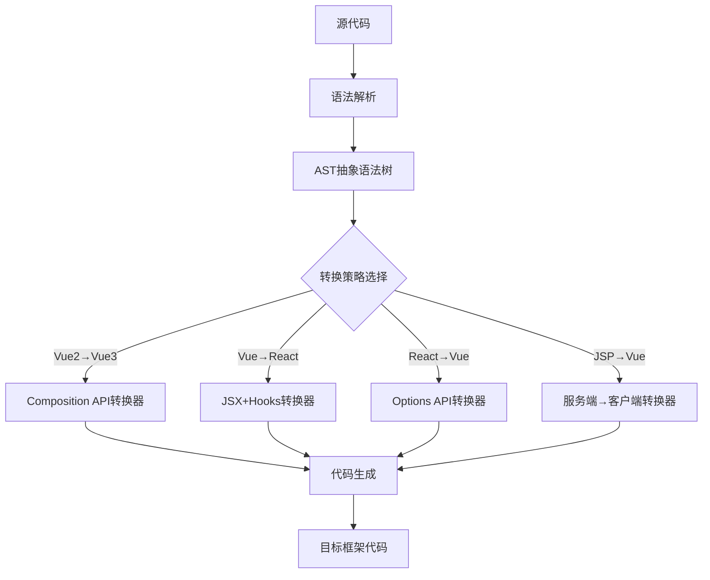

# Auto-stv
智能前端页面相互转换平台。
## 项目概述
开发一个**高科技风格**的**前端框架互转平台**，使用**SpringBoot 3.2 + Vue3 + TypeScript**技术栈，实现**Servlet/JSP、Vue2、Vue3、React、Angular、Flutter**等前端技术栈之间的代码智能转换。平台需支持**单文件转换**与**批量项目转换**两种模式，采用左右对比布局，左侧输入源代码/目录，右侧显示目标框架代码，界面需具备未来科技感，深色主题+霓虹光效，无登录流程，开箱即用。

## 核心功能要求

### 1. 框架支持矩阵
| 源框架 | 目标框架 | 转换完整性要求 |
|-------|----------|--------------|
| Vue2 | Vue3 | 100% (Composition API转换) |
| Vue2 | React | 90% (JSX+Hooks映射) |
| Vue3 | React | 95% (含Suspense/Concurrent) |
| React | Vue3 | 90% (Options API兼容) |
| Angular | Vue3 | 85% (指令/管道映射) |
| JSP/Servlet | Vue3 | 80% (逻辑提取+组件化) |
| Vue3 | Flutter | 75% (UI组件映射) |
| React | Flutter | 75% (状态管理映射) |
| **其他组合** | **智能降级** | 70%+ (核心功能保留) |

### 2. 单文件转换模式
- **双面板布局**：
  - 左侧面板：源代码编辑器 + 框架选择器
  - 右侧面板：转换结果预览 + 框架选择器
  - 中间：转换按钮 + 动画过渡效果
- **智能编辑器**：
  - 语法高亮（根据源框架自动切换）
  - 代码折叠/展开
  - 行号显示
  - 问题标记（转换难点高亮）
- **实时转换**：
  - 延迟500ms自动转换（可配置）
  - 转换进度可视化
  - 转换复杂度评分（1-5星）

### 3. 批量项目转换模式
- **目录结构映射**：
  - 智能识别项目结构
  - 保留目录层级
  - 生成转换映射报告
- **配置文件处理**：
  - package.json依赖转换
  - 配置文件自动适配（webpack.config.js → vite.config.ts）
  - 路由配置转换
- **批量操作**：
  - 选择本地目录（Web API）
  - 预览转换文件列表
  - 选择性转换（勾选文件）
  - 一键下载转换后项目

### 4. 转换引擎核心能力
- **组件映射**：
  ```mermaid
  graph LR
    VueComponent[Vue组件] -->|转换规则| ReactComponent[React组件]
    ReactComponent -->|转换规则| FlutterWidget[Flutter组件]
    JSPPage[JSP页面] -->|提取逻辑| Vue3Module[Vue3模块]
  ```
- **状态管理转换**：
  - Vuex → Redux/Zustand
  - Redux → Pinia
  - Angular Services → Composition API
- **样式转换**：
  - CSS-in-JS ↔ Scoped CSS
  - Tailwind类名保留
  - 响应式断点映射
- **生命周期映射**：
  - mounted → useEffect
  - ngOnChanges → watch
  - initState → onMounted

### 5. 智能辅助功能
- **转换建议**：
  - 无法转换部分高亮提示
  - 替代方案推荐
  - 人工干预点标记
- **差异对比**：
  - 转换前后功能差异报告
  - 性能影响评估
  - 包体积变化预测
- **历史记录**：
  - 本地保存最近20次转换
  - 支持恢复/对比历史版本
  - 导出转换报告

## 技术栈规范

### 后端 (SpringBoot 3.2)
```yaml
framework:
  - Spring Boot 3.2.3
  - Java 17
  - Spring WebFlux (响应式处理)
  - HTMX (部分页面更新)

conversion_engine:
  - AST解析器 (自研)
  - 框架特定转换器 (Plugin架构)
  - 语法树转换引擎
  - 代码生成器

core_libraries:
  - ANTLR 4.12 (语法分析)
  - Jackson 2.15 (JSON处理)
  - Commons IO 2.13 (文件操作)
  - Lombok 1.18 (简化代码)

architecture:
  - 插件化设计 (每个框架转换独立模块)
  - 转换规则配置化
  - 无状态服务 (无数据库)
```

### 前端 (Vue3 + TypeScript)
```yaml
core:
  - Vue 3.4.21
  - TypeScript 5.4.2
  - Vite 5.1.6
  - Pinia 2.1.7 (状态管理)

ui_framework:
  - Custom UI (不使用标准组件库)
  - Monaco Editor (代码编辑)
  - Vue Flow (转换流程可视化)
  - Three.js (3D效果)

visualization:
  - 粒子动效背景
  - 霓虹边框与光晕
  - 转换过程3D动画
  - 框架标识3D模型

build:
  - Vite优化配置
  - 代码分割
  - 预渲染关键页面
```

## 界面设计规范 (高科技风格)

### 主题设计
- **色彩方案**：
  - 背景色: #0a0e17 (深空黑)
  - 主色: #00f3ff (霓虹青)
  - 辅助色: #7209b7 (紫罗兰), #ff6b6b (警告红)
  - 文字色: #e6e6ff (淡青)
- **字体**：
  - 标题: Rajdhani (600 weight)
  - 代码: JetBrains Mono
  - 正文: Exo 2.0
- **动效规范**：
  - 按钮: 霓虹脉冲效果
  - 面板切换: 3D翻转
  - 转换过程: 粒子流动动画
  - 悬停效果: 光晕扩散

### 核心界面布局
```vue
<template>
  <div class="converter-platform">
    <!-- 全局粒子背景 -->
    <ParticleCanvas />
    
    <header class="platform-header">
      <h1 class="logo">
        FRAME<span class="accent">FLOW</span>
        <span class="subtitle">前端框架互转平台</span>
      </h1>
      <div class="mode-switch">
        <ToggleButton 
          :options="[{label: '单文件', value: 'single'}, {label: '批量项目', value: 'batch'}]"
          v-model="conversionMode"
        />
      </div>
    </header>
    
    <main class="conversion-area" v-if="conversionMode === 'single'">
      <div class="source-panel">
        <PanelHeader 
          title="源代码" 
          :frameworks="supportedFrameworks" 
          v-model:selectedFramework="sourceFramework"
        />
        <CodeEditor 
          v-model="sourceCode" 
          :language="editorLanguageMap[sourceFramework]" 
          class="main-editor"
          @change="scheduleConversion"
        />
        <div class="file-operations">
          <FileUploader @file-selected="handleFileSelect" />
          <button class="neon-button" @click="useExample">使用示例</button>
        </div>
      </div>
      
      <div class="converter-control">
        <div class="conversion-button" @click="executeConversion">
          <span class="arrow-icon">→</span>
          <div class="glow-effect"></div>
        </div>
        <ConversionSettings v-model="conversionOptions" />
      </div>
      
      <div class="target-panel">
        <PanelHeader 
          title="转换结果" 
          :frameworks="supportedFrameworks" 
          v-model:selectedFramework="targetFramework"
        />
        <CodeEditor 
          v-model="targetCode" 
          :language="editorLanguageMap[targetFramework]" 
          class="main-editor"
          readonly
        />
        <div class="output-actions">
          <button class="neon-button copy-btn" @click="copyResult">
            <span class="icon-copy"></span>复制结果
          </button>
          <button class="neon-button download-btn" @click="downloadResult">
            <span class="icon-download"></span>下载文件
          </button>
        </div>
      </div>
    </main>
    
    <main class="batch-conversion-area" v-else>
      <!-- 批量转换界面 -->
      <BatchConversionPanel />
    </main>
    
    <section class="conversion-insights" v-if="conversionReport">
      <ConversionReport :report="conversionReport" />
    </section>
    
    <footer class="platform-footer">
      <div class="status-indicator" :class="{active: isConverting}">
        {{ isConverting ? '转换中...' : '就绪' }}
      </div>
      <div class="conversion-stats">
        <span>已转换: {{ conversionHistory.length }}</span>
        <span>成功率: {{ successRate }}%</span>
      </div>
    </footer>
  </div>
</template>
```

### 关键界面组件
1. **3D框架标识**：
   - 每个框架有专属3D模型（Vue立方体、React原子、Angular盾牌等）
   - 悬停时展示框架信息

2. **转换进度可视化**：
   - 粒子流动动画表示转换进度
   - 复杂度指示器（简单/中等/复杂）

3. **差异对比面板**：
   - 并排对比源码与目标码
   - 差异部分高亮显示
   - 问题标记（❗️需要人工干预）

4. **批量转换目录树**：
   - 3D文件结构可视化
   - 文件类型色彩编码
   - 转换状态进度条

## 转换引擎设计规范

### 1. 转换架构


### 2. 核心转换规则示例
```java
// Vue2 Options API → Vue3 Composition API
public class Vue2ToVue3Converter implements FrameworkConverter {
    
    @Override
    public ConversionResult convert(String sourceCode, ConversionContext context) {
        // 1. 解析AST
        VueAstNode ast = vueParser.parse(sourceCode);
        
        // 2. 转换data函数
        ast.findNodes(node -> node.isDataSection())
           .forEach(node -> {
               node.replaceWith(compositionApiGenerator.generateReactiveData(node));
           });
        
        // 3. 转换methods
        ast.findNodes(node -> node.isMethodsSection())
           .forEach(node -> {
               node.replaceWith(compositionApiGenerator.generateMethodsAsFunctions(node));
           });
        
        // 4. 转换生命周期
        lifecycleMapper.mapLifecycleHooks(ast);
        
        // 5. 生成新代码
        String targetCode = codeGenerator.generate(ast);
        
        return ConversionResult.builder()
                .targetCode(targetCode)
                .conversionScore(95)
                .issues(detectPotentialIssues(targetCode))
                .build();
    }
}
```

### 3. 转换质量保障
- **单元测试覆盖**：
  - 每个转换规则必须有对应测试用例
  - 覆盖率≥90%
- **人工校准**：
  - 内置200+真实场景测试样本
  - 转换质量评分机制
- **回退机制**：
  - 转换失败时提供原始代码
  - 标记不可转换部分

## API接口设计

### 后端API
```java
@RestController
@RequestMapping("/api/convert")
public class ConversionController {

    // 1. 框架转换API (单文件)
    @PostMapping("/single")
    public ResponseEntity<ConversionResponse> convertSingle(
            @RequestBody ConversionRequest request) {
        // 执行转换逻辑
        ConversionResult result = conversionService.convert(
                request.getSourceCode(),
                request.getSourceFramework(),
                request.getTargetFramework(),
                request.getOptions()
        );
        
        // 生成响应
        return ResponseEntity.ok(
                ConversionResponse.builder()
                        .targetCode(result.getTargetCode())
                        .conversionScore(result.getScore())
                        .issues(result.getIssues())
                        .metadata(result.getMetadata())
                        .build()
        );
    }
    
    // 2. 批量转换API
    @PostMapping("/batch")
    public ResponseEntity<BatchConversionResponse> convertBatch(
            @RequestParam("sourceDir") MultipartFile sourceZip,
            @RequestParam("sourceFramework") String sourceFramework,
            @RequestParam("targetFramework") String targetFramework) {
        // 处理ZIP文件
        // 执行批量转换
        // 生成转换报告
        // 返回ZIP下载链接
    }
    
    // 3. 框架支持查询
    @GetMapping("/frameworks")
    public ResponseEntity<FrameworkSupportMatrix> getSupportedFrameworks() {
        // 返回支持的框架矩阵
    }
}
```

### 前端API封装
```typescript
// api/conversion.ts
export interface ConversionRequest {
  sourceCode: string;
  sourceFramework: FrameworkType;
  targetFramework: FrameworkType;
  options: {
    preserveComments: boolean;
    convertStyles: boolean;
    advancedOptimizations: boolean;
  };
}

export interface ConversionResponse {
  targetCode: string;
  conversionScore: number; // 0-100
  issues: Array<{
    type: 'WARNING' | 'ERROR' | 'INFO';
    message: string;
    lineNumbers: number[];
    suggestion: string;
  }>;
  metadata: {
    executionTime: number;
    complexity: 'SIMPLE' | 'MODERATE' | 'COMPLEX';
  };
}

// 转换API
export const convertCode = async (request: ConversionRequest): Promise<ConversionResponse> => {
  const response = await fetch('/api/convert/single', {
    method: 'POST',
    headers: { 'Content-Type': 'application/json' },
    body: JSON.stringify(request)
  });
  
  if (!response.ok) {
    throw new Error('转换失败');
  }
  
  return response.json();
};
```

## 代码目录结构

### 后端结构
```
src/main/java/com/frameflow/
├── config/
│   ├── WebConfig.java          # Web配置
│   └── ConverterConfig.java    # 转换器配置
├── controller/
│   └── ConversionController.java
├── converter/
│   ├── core/
│   │   ├── ConversionEngine.java
│   │   ├── AstParser.java
│   │   └── CodeGenerator.java
│   ├── framework/
│   │   ├── vue/
│   │   │   ├── Vue2ToVue3Converter.java
│   │   │   ├── VueToReactConverter.java
│   │   │   └── VueToAngularConverter.java
│   │   ├── react/
│   │   │   ├── ReactToVue3Converter.java
│   │   │   └── ReactToFlutterConverter.java
│   │   ├── angular/
│   │   │   └── AngularToVue3Converter.java
│   │   └── servlet/
│   │       └── JspToVue3Converter.java
│   └── utils/
│       ├── CodeFormatter.java
│       └── DependencyMapper.java
├── dto/
│   ├── request/
│   └── response/
├── exception/
│   └── ConversionException.java
└── FrameFlowApplication.java
```

### 前端结构
```
src/
├── api/
│   ├── conversion.js            # 转换API
│   └── frameworks.js            # 框架支持API
├── assets/
│   ├── fonts/                   # 自定义字体
│   ├── particles/               # 粒子效果配置
│   └── models/                  # 3D模型
├── components/
│   ├── layout/
│   │   ├── ParticleCanvas.vue   # 粒子背景
│   │   └── NeonHeader.vue       # 霓虹标题
│   ├── editor/
│   │   ├── CodeEditor.vue       # 代码编辑器
│   │   └── FrameworkSelector.vue
│   ├── conversion/
│   │   ├── ConversionPanel.vue  # 转换主面板
│   │   ├── BatchConversion.vue  # 批量转换
│   │   └── ConversionReport.vue # 转换报告
│   └── ui/
│       ├── NeonButton.vue       # 霓虹按钮
│       ├── ToggleButton.vue     # 切换按钮
│       └── ThreeDModel.vue      # 3D模型组件
├── composables/
│   ├── useConversionEngine.js   # 转换逻辑
│   └── useFrameworkSupport.js   # 框架支持
├── stores/
│   └── conversionStore.js       # 转换状态
├── styles/
│   ├── theme.scss               # 主题样式
│   ├── neon-effects.scss        # 霓虹效果
│   └── editor-themes/           # 编辑器主题
├── utils/
│   ├── codeFormatter.js         # 代码格式化
│   └── fileUtils.js             # 文件处理
├── views/
│   └── ConverterView.vue        # 主视图
├── App.vue
└── main.js
```

## 部署与运行

### 1. 本地运行
```bash
# 后端
./mvnw spring-boot:run

# 前端
npm install
npm run dev
```

### 2. 生产构建
```bash
# 后端
./mvnw clean package -DskipTests

# 前端
npm run build

# 运行
java -jar target/frameflow-converter-1.0.jar
```

### 3. 系统要求
- **内存**: ≥4GB (转换大文件需要)
- **存储**: ≥500MB (临时文件)
- **浏览器**: Chrome 100+ (Web Worker支持)

## 质量与验收标准

### 1. 功能验收
- [ ] 支持6种框架相互转换
- [ ] 单文件转换延迟<2s (500行代码内)
- [ ] 批量转换100文件<30s
- [ ] 转换准确率≥85% (核心功能)
- [ ] 3D可视化效果流畅
- [ ] 完整的用户操作引导

### 2. 界面验收
- [ ] 深色主题+霓虹光效
- [ ] 60fps动画流畅度
- [ ] 响应式布局 (支持1366px+)
- [ ] 无闪烁/卡顿
- [ ] 高对比度文字可读

### 3. 性能要求
- [ ] 首屏加载<1.5s
- [ ] 代码编辑无延迟
- [ ] 内存占用<500MB
- [ ] 支持10000+行代码编辑

## 特别强调

1. **开箱即用**：
   - 无需注册登录
   - 首次访问显示交互式教程
   - 提供多种框架示例代码

2. **真实转换能力**：
   - 不是简单字符串替换
   - 理解框架概念与模式
   - 保留业务逻辑完整性

3. **高科技UI/UX**：
   - 必须包含粒子背景
   - 框架选择必须3D可视化
   - 转换过程必须有动效反馈
   - 霓虹元素必须发光+脉冲

4. **错误处理**：
   - 转换失败时提供详细原因
   - 复杂代码分段转换
   - 部分成功时保留可用部分

5. **可扩展性**：
   - 转换器插件化设计
   - 规则配置外部化
   - 新框架添加只需实现接口

> **交付要求**：生成完整可运行项目，启动后访问 http://localhost:8080 即可使用，无需任何配置。界面必须达到科幻电影级视觉效果，转换质量必须能处理真实业务代码，包括状态管理、生命周期、组件通信等复杂场景。代码注释率≥40%，提供完整README文档包含部署指南与架构说明。转换引擎必须模块化，便于后续扩展新框架支持。